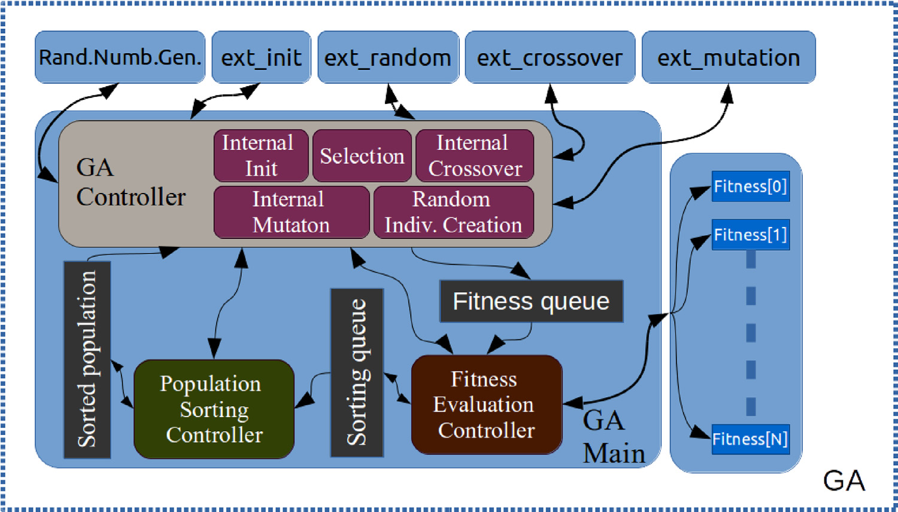
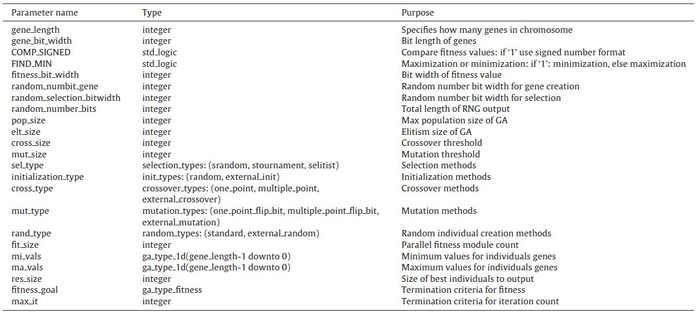

# FC-GPA on FPGA


## A fully customizable hardware implementation for general-purpose genetic algorithms

In this work, a fully customizable general purpose genetic algorithm (GA) IP core has been proposed for field programmable gate arrays (FPGAs) using the pipeline and parallel architectures to speed up the GA process. The proposed system is implemented on FPGA and coded with very high speed integrated circuits (VHSIC) hardware description language (VHDL). The GA operators and the fitness functions are designed in a modular structure to enable the use of these modules asynchronously. The VHDL code is written with generic parameters to allow the customization of almost every parameter of the proposed FPGA IP Core depending on the problem. The proposed architecture synthesized and tested on Altera DE2-115 board with approximately 12% logic elements utilization. Results are obtained from standard optimization benchmark functions and the traveling salesman problem (TSP). In the hardware experiments, the proposed FPGA IP Core has been found the global optimum solutions for all of the standard benchmark functions and TSP. The clock cycle per generation value of the proposed FPGA IP Core has been decreased up to approximately 95% when compared with the existing implementations. For the TSP case, the proposed FPGA IP Core has reduced the run-time of the compared work approximately 75% and with optimized parameters, the reducement reached approximately 99%. For all test cases, it is concluded that the proposed core enhanced both the clock cycles needed to iterate one generation and the convergence speed of the existing GA implementations.


## Core Design


Fig.2 The block scheme of the proposed FPGA IP core design.


## The customizable parameters of the proposed FPGA IP core.

These parameters are located in folder `./pkgs/types.vhd`.


## Publication

If you want to use this work, please consider citing the following [paper](http://www.sciencedirect.com/science/article/pii/S1568494617305835).

```
@InProceedings{Li_2020_WACV,
    author = {Li, Liangzhi and Verma, Manisha and Nakashima, Yuta and Nagahara, Hajime and Kawasaki, Ryo},
    title = {IterNet: Retinal Image Segmentation Utilizing Structural Redundancy in Vessel Networks},
    booktitle = {The IEEE Winter Conference on Applications of Computer Vision (WACV)},
    month = {March},
    year = {2020}
}

@article{PEKER20181066,
author = "Murat Peker",
title = "A fully customizable hardware implementation for general purpose genetic algorithms",
journal = "Applied Soft Computing",
volume = "62",
pages = "1066 - 1076",
year = "2018",
issn = "1568-4946",
doi = "https://doi.org/10.1016/j.asoc.2017.09.044",
url = "http://www.sciencedirect.com/science/article/pii/S1568494617305835"
}
```

## License

This project is licensed under the MIT License.
